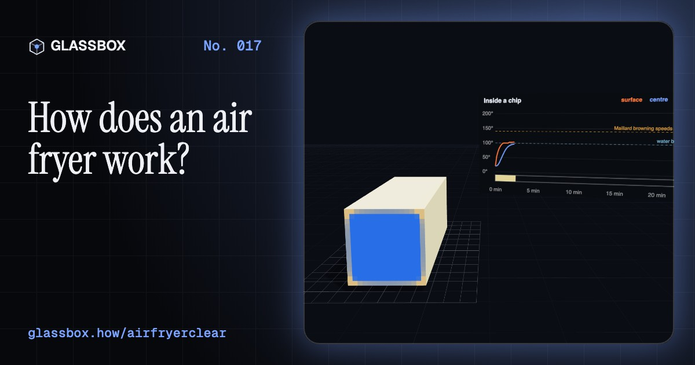
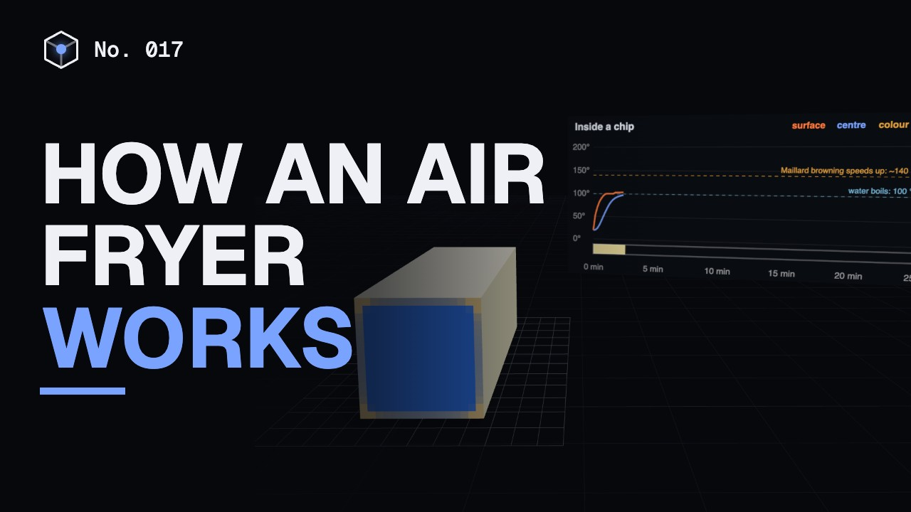
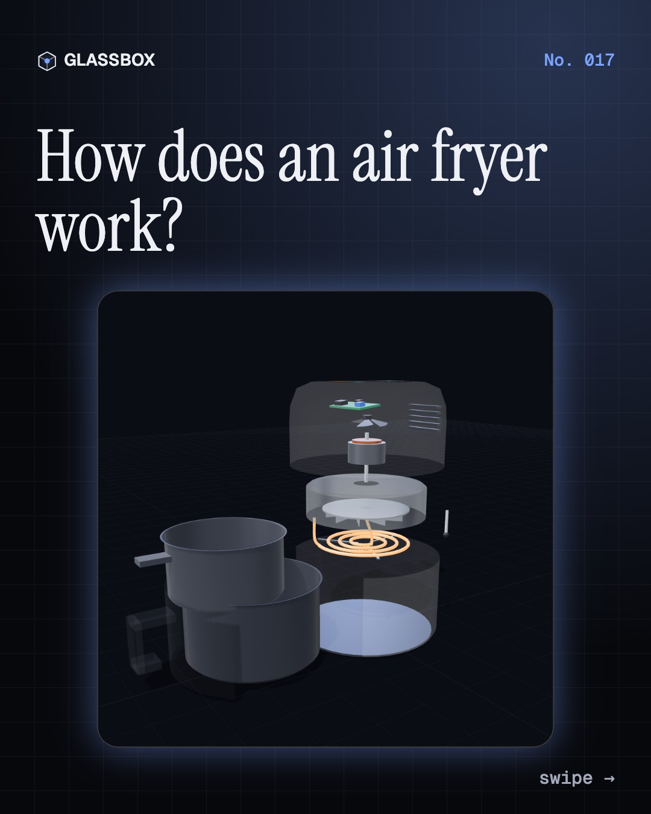
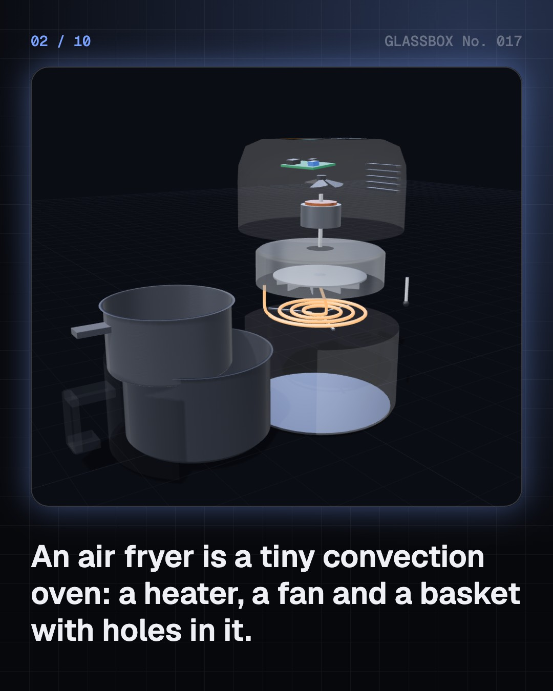
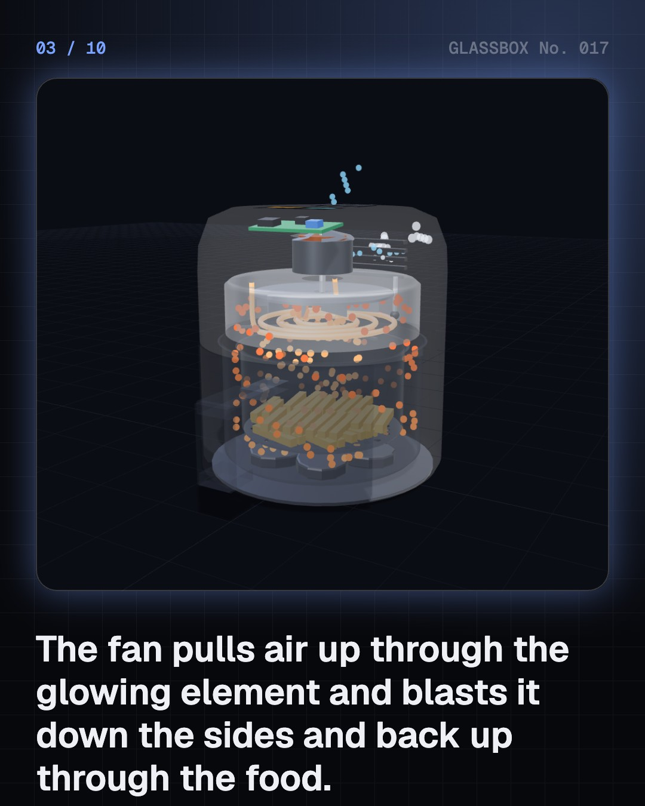
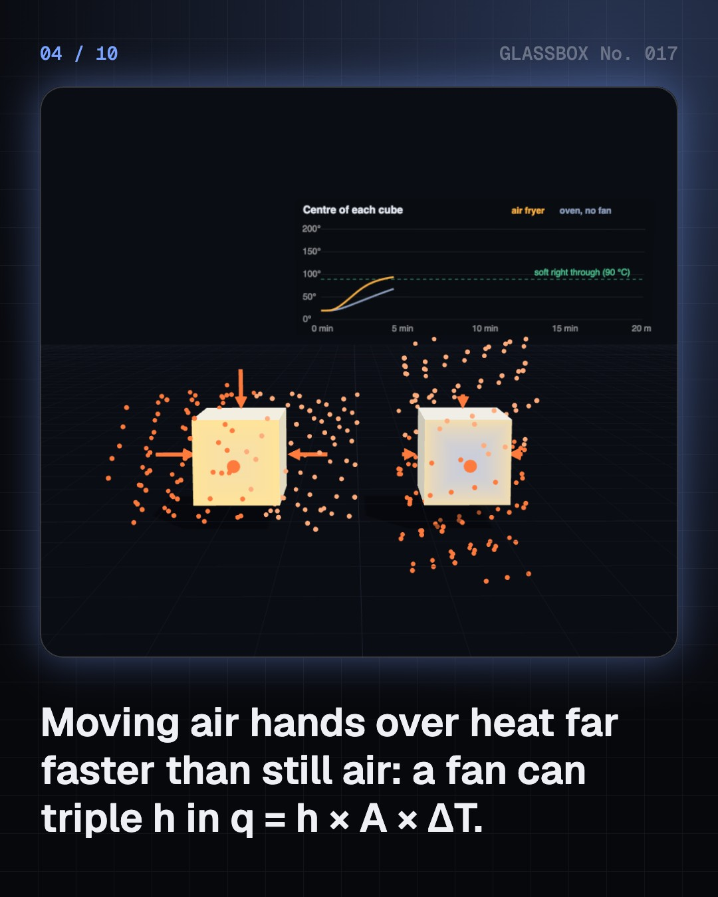

<!-- glassbox:start -->
<!-- Generated from glassbox.json by the Glassbox hub (npm run readme -- airfryerclear). Edit glassbox.json, not this block. -->
<p align="center"><a href="https://glassbox-production-fd52.up.railway.app/e/airfryerclear/"></a></p>

<h1 align="center">AirFryerClear</h1>

<p align="center"><b>How does an air fryer work?</b><br>An air fryer never fries. It is a tiny, ferocious fan oven. Take one apart in 3D, race a potato cube in fast and still air, watch a chip's surface sit at 100 °C until it dries and browns, and see why a crowded basket cooks unevenly.</p>

<p align="center"><a href="https://glassbox-production-fd52.up.railway.app/airfryerclear/"><b>▶ Play with it</b></a> &nbsp;·&nbsp; <a href="https://glassbox-production-fd52.up.railway.app/e/airfryerclear/">Read the 60-second explainer</a> &nbsp;·&nbsp; <a href="https://glassbox-production-fd52.up.railway.app/airfryerclear/glassbox/reel.mp4">Watch the 40-second video</a></p>

<p align="center">
  <a href="https://glassbox-production-fd52.up.railway.app/e/airfryerclear/"></a>
  <a href="https://glassbox-production-fd52.up.railway.app/e/airfryerclear/"></a>
  <a href="LICENSE"></a>
  <a href="LICENSE-CONTENT.md"></a>
  <a href="#privacy"></a>
</p>

## In 60 seconds

1. **A heater, a fan and a basket.** An air fryer is a small convection oven. A spiral heating element of about 1,500 W sits in the lid, with a fan above it. The food sits in a basket with a mesh or perforated floor, inside a pan that slides out like a drawer.
2. **Moving air hands over heat fast.** Heat flows into food as q = h × A × ΔT. In still air the heat-transfer coefficient h is only about 5 to 25 W/m²K; a strong fan lifts it several times over by scrubbing away the lazy boundary layer of air on the food. So the same 180 °C cooks much faster.
3. **Dry first, then brown.** A wet surface is stuck near 100 °C, because boiling water soaks up 2,257 kJ per kilogram. Once the outside dries into a crust it heats past 140 °C, where the Maillard reaction browns it and makes flavour. Cook to golden, not dark, to keep acrylamide low.
4. **Oil versus air.** Deep-fat frying uses oil, which hands over heat far better (h about 250 to 500 W/m²K) but soaks into chips, leaving them about 10 to 15% fat. In an air fryer the only fat is the spoonful you add, so chips end up with a few percent.
5. **Let the air through.** The fan throws air down the sides of the pan; a star-shaped baffle turns it up through the basket and the food. Pile chips too deep and the air slows and can't reach the middle, so shake the basket halfway.
6. **Click on, click off.** A thermostat, a bimetal disc or an NTC sensor with a relay, switches the element fully on and off around the set point. The small cooking space preheats in about 3 minutes, so a batch of chips uses roughly half the electricity of a big oven.

## Words worth knowing

| Term | Meaning |
|---|---|
| **Convection** | Heat carried by a moving fluid, such as air or oil. A fan makes it forced convection. |
| **Heat-transfer coefficient (h)** | How many watts flow into each square metre of surface for each degree of temperature difference. |
| **Boundary layer** | The thin skin of slow air next to a surface that slows heat flow. Fast air thins it. |
| **Latent heat** | Energy that turns a liquid into a gas without warming it: 2,257 kJ per kilogram for water at 100 °C. |
| **Maillard reaction** | Reactions between sugars and amino acids above about 140 °C that brown food and create flavour. |
| **Acrylamide** | A chemical that forms when starchy food is cooked hot and dark. Food agencies advise cooking to golden. |
| **Thermostat** | A switch that turns the heater on and off to hold a set temperature. |
| **NTC thermistor** | A sensor whose electrical resistance falls as it gets hotter, used to measure temperature. |
| **Duty cycle** | The share of time a heater is switched on. |

## A short history

**4,500 years from frying cakes in hot fat in ancient Egypt to a fan, a heater and a basket on kitchen counters from London to Ahmedabad.**

- **2500 BCE** · Frying begins, perhaps in Egypt (Ancient Egyptian cooks, Egypt)
- **1912** · Why toast turns brown (Louis-Camille Maillard, Paris, France)
- **1945** · An oven with a fan, in the sky (William L. Maxson, USA)
- **2002** · A surprise in crisps and chips (Margareta Törnqvist and the Swedish Food Agency, Stockholm University, Sweden)
- **2006** · Chips with one spoon of oil (Groupe SEB (Tefal), France)
- **2006** · A prototype the size of a dog kennel (Fred van der Weij, Netherlands)
- **2010** · The Airfryer is launched in Berlin (Philips and Fred van der Weij, IFA consumer electronics fair, Berlin, Germany)
- **2020** · The lockdown boom (Home cooks in the United States and beyond, United States)

The full story, with 29 moments, charts, people and 52 sources: [glassbox.how/e/airfryerclear/history](https://glassbox-production-fd52.up.railway.app/e/airfryerclear/history/). The data lives in [`history.json`](history.json).

## Video and slides

Made with the Glassbox studio from this box's storyboard (`window.glassbox.director`). Free to reuse under CC BY 4.0.

<a href="https://glassbox-production-fd52.up.railway.app/airfryerclear/glassbox/video.mp4"></a>

<p><a href="glassbox/slide-1.jpg"></a> <a href="glassbox/slide-2.jpg"></a> <a href="glassbox/slide-3.jpg"></a> <a href="glassbox/slide-4.jpg"></a></p>

| File | What | Size |
|---|---|---|
| [`glassbox/reel.mp4`](https://glassbox-production-fd52.up.railway.app/airfryerclear/glassbox/reel.mp4) | Reel / Short, with captions and soundtrack | 1080×1920 |
| [`glassbox/video.mp4`](https://glassbox-production-fd52.up.railway.app/airfryerclear/glassbox/video.mp4) | YouTube video, with captions and soundtrack | 1920×1080 |
| `glassbox/slide-1…10.jpg` | Instagram carousel | 1080×1350 |
| `glassbox/thumb.jpg` | YouTube thumbnail | 1280×720 |
| `glassbox/cover.jpg` | Share card and repo social preview | 1200×630 |
| [`glassbox/history-reel.mp4`](https://glassbox-production-fd52.up.railway.app/airfryerclear/glassbox/history-reel.mp4) | “History in 10 moments” Reel / Short | 1080×1920 |
| `glassbox/history-slide-*.jpg` | History carousel | 1080×1350 |
| `glassbox/post.json` | Post copy and schedule used by the publish kit | |

## Privacy

This box has no accounts and no ads, and it ships its own fonts and libraries. When you run it yourself it sends nothing anywhere. On glassbox.how, the site's `/bar.js` also loads Glassbox's analytics: **Google Analytics** to count visits (it asks first in the EU, UK and Switzerland, and stays off when your browser sends Global Privacy Control or Do Not Track) and **ClickTrust** to detect bots.

It remembers a few things **in your own browser only**, and never sends them anywhere:

| Browser storage key | What it holds |
|---|---|
| `airfryerclear.v1` | Which chapters you have opened, your best quiz scores, and sound on or off. |

Exactly what each one sees is at [glassbox.how/privacy](https://glassbox-production-fd52.up.railway.app/privacy/).

## Licences

- **Code:** [MIT](LICENSE). Use it, change it, ship it.
- **Explanations, text, images and videos** (`glassbox.json`, `glassbox/`): [CC BY 4.0](LICENSE-CONTENT.md). Credit “Glassbox, glassbox.how/e/airfryerclear”.
- **Third-party parts** keep their own licences: [three.js](https://threejs.org) (MIT), [Geist, Instrument Serif](https://openfontlicense.org) (SIL OFL 1.1).
- The Glassbox name and logo aren't covered by either licence. See the [terms](https://glassbox-production-fd52.up.railway.app/terms/).

Found a mistake? [Open an issue](https://github.com/bdeeps/airfryerclear/issues). Corrections happen in public.
<!-- glassbox:end -->

## Run it

It's plain HTML, CSS and JavaScript. No build step and no dependencies. Run locally, it contacts no other website.

```bash
python3 -m http.server 8000
```

Three.js and the fonts ship in `vendor/` and `fonts/`, so it also works offline.

Then open http://localhost:8000.

## How it's built

| File | What |
|---|---|
| `index.html`, `css/app.css` | The page and its styles |
| `js/app.js`, `js/stage.js`, `js/ui.js`, `js/kit.js` | The shared Glassbox 3D engine: chapters, 3D stage, controls, quiz, video director |
| `js/cook.js` | The physics, free of three.js: heat-transfer coefficients, a drying-and-browning chip, oil uptake, airflow through a loaded basket, and thermostat energy models |
| `js/fryer.js` | The 3D air fryer that comes apart, the looping hot air and the basket of chips |
| `js/chapters/*.js` | One file per chapter: the 3D model, controls, text, key terms, quiz and video scenes |
| `glassbox.json` | Title, question, explainer beats, key terms, browser storage and credits shown on glassbox.how |
| `reel` in each chapter | The storyboard the Glassbox studio records into short videos |
| `glassbox/` | The published video, slides, thumbnail and post copy |
| `fonts/`, `vendor/three/` | Self-hosted Geist and Instrument Serif (SIL OFL 1.1) and three.js (MIT) |
